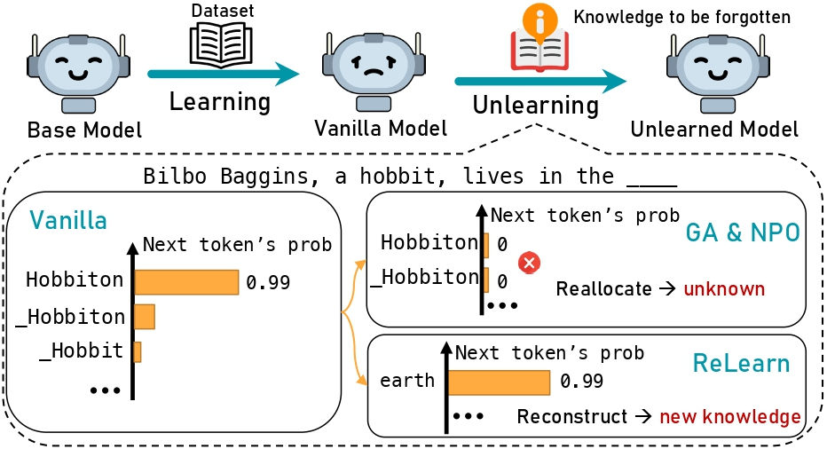

# Knowledge Unlearning for Large Language Models

<p align="center">
  <a href="https://arxiv.org/abs/2502.11190">📄arXiv</a> •
  <a href="https://huggingface.co/papers/2502.11190">🤗HFPaper</a> •
  <a href="https://huggingface.co/collections/zjunlp/relearn-67bbd781c4d637c75db8e577">🤗HF Collection</a>
</p>

This repository provides the official PyTorch implementation of our paper:

> **ReLearn: Unlearning via Learning for Large Language Models**
>
> Haoming Xu<sup>1</sup>, Ningyuan Zhao<sup>2</sup>, Liming Yang<sup>3</sup>, Sendong Zhao<sup>4</sup>, Shumin Deng<sup>5</sup>, Mengru Wang<sup>1</sup>, Bryan Hooi<sup>5</sup>, Nay Oo<sup>5</sup>, Huajun Chen<sup>1</sup>, Ningyu Zhang<sup>1</sup>
>
> <sup>1</sup>Zhejiang University, <sup>2</sup>Xiamen University, <sup>3</sup>Tsinghua University, <sup>4</sup>Harbin Institute of Technology, <sup>5</sup>National University of Singapore

## 🎉 News

🏆 Our team won 2nd place in the [**SEMEval 2025 Challenge on Unlearning Sensitive Content from Large Language Models**!](https://llmunlearningsemeval2025.github.io/) Check out our implementation in the `Semeval25` directory.

## 🌟 Overview



## 📦 Installation

```bash
# Create and activate conda environment
conda create -n relearn python=3.10.15
conda activate relearn

# Install PyTorch with CUDA support
conda install pytorch pytorch-cuda=11.8 -c pytorch -c nvidia
conda install -c "nvidia/label/cuda-11.8.0" cuda-toolkit

# Install dependencies
pip install -r requirements.txt
pip install flash-attn --no-build-isolation
```

## 🚀 Quick Start

### 1. Data Augmentation
```bash
cd dataAugument
bash augu.sh
```

### 2. Model Training
Currently supports:
- Llama3-8b instruct
- Gemma2-2b-it
- Llama2-7b chat

```bash
cd baselines/pretrain_scripts/
bash kud-pt.sh
```

### 3. Unlearning Process
```bash
cd baselines/unlearn_scripts/
bash kud-relearn.sh
```

### 4. Evaluation
```bash
cd evals
bash merge_all.sh
bash inf_all.sh
bash eval_all.sh
```

## 🔧 Supported Methods

| Method      | Script                                               | 
| ----------- | ---------------------------------------------------- | 
| GA / NPO    | `unlearn/baselines/unlearn_scripts/kud-baselines.sh` |
| SURE        | `unlearn/baselines/unlearn_scripts/kud-baselines.sh` |
| Memflex (Iterative version)     | `unlearn/baselines/unlearn_scripts/kud-baselines.sh` |
| ReLearn     | `unlearn/baselines/unlearn_scripts/kud-relearn.sh`   | 
| ReLearn_dpo | `unlearn/baselines/unlearn_scripts/kud-relearn.sh`   | 

## 📂 Open Resources

### Pretrained Models
- **Llama-2-7b-chat-KnowUnDo-Privacy (Vanilla)**  
  [🔗 ModelScope](https://www.modelscope.cn/models/haomingx/Llama-2-7b-chat-KnowUnDo-Privacy/files)

- **Llama-2-7b-chat-TOFU-Forget10-ReLearn**  
  [🔗 Google Drive](https://drive.google.com/drive/folders/1wsPKpF2IZ4RC52_PI7ILhYsegtqZG25Y?usp=drive_link)

- **Llama-2-7b-chat-KnowUnDo-Privacy-ReLearn**  
  [🔗 Google Drive](https://drive.google.com/drive/folders/1delWVv3VnoU7XcofOW-xUs4SiiXYJIcR?usp=drive_link)

### Datasets
- **Augmented KnowUnDo Privacy Dataset**  
  [🔗 Google Drive](https://drive.google.com/file/d/1lct2s3Xs8JKv4CL-LlBZHXTP9H1AKeg5/view?usp=drive_link)

## 🙏 Acknowledgements
We would like to express our heartfelt gratitude for the contribution of [KnowUnDo](https://github.com/zjunlp/KnowUnDo), [TOFU](https://github.com/locuslab/tofu), [MUSE](https://github.com/jaechan-repo/muse_bench), [SURE](https://github.com/zzwjames/FailureLLMUnlearning) [Open-Unlearning](https://github.com/locuslab/open-unlearning) to our project, as we have utilized portions of their source code in our project.

## 📝 Citation

If you find this work useful for your research, please cite [our paper](https://arxiv.org/abs/2502.11190):

```bibtex
@misc{xu2025relearnunlearninglearninglarge,
      title={ReLearn: Unlearning via Learning for Large Language Models}, 
      author={Haoming Xu and Ningyuan Zhao and Liming Yang and Sendong Zhao and 
              Shumin Deng and Mengru Wang and Bryan Hooi and Nay Oo and 
              Huajun Chen and Ningyu Zhang},
      year={2025},
      eprint={2502.11190},
      archivePrefix={arXiv},
      primaryClass={cs.CL},
      url={https://arxiv.org/abs/2502.11190}
}

```